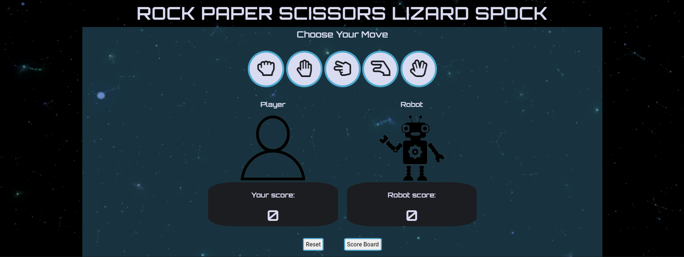
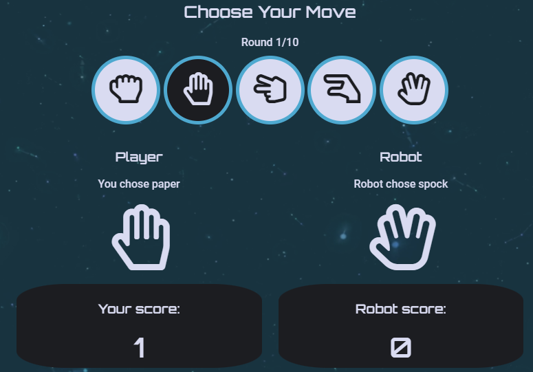
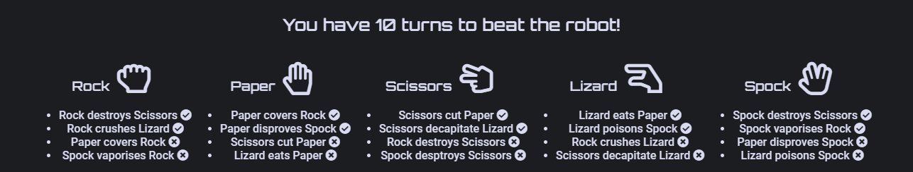
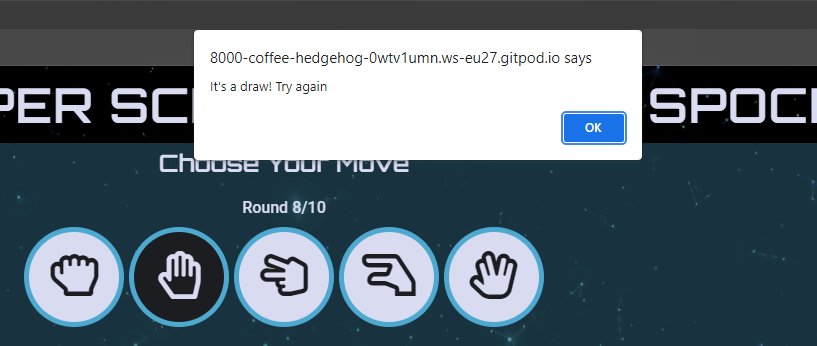
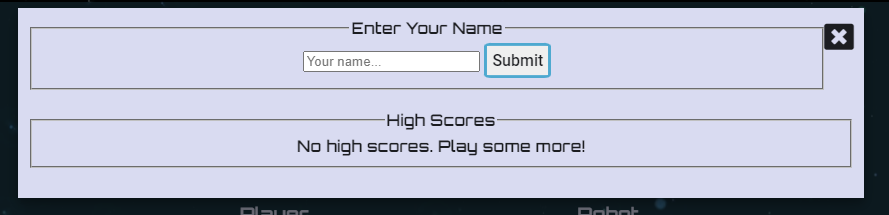
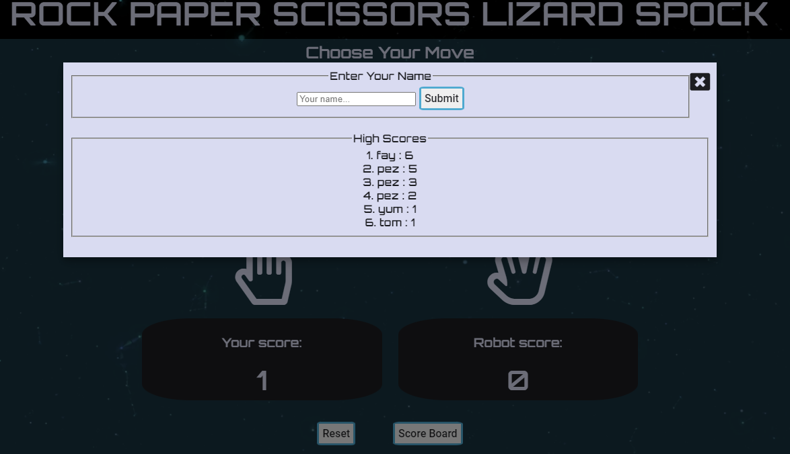
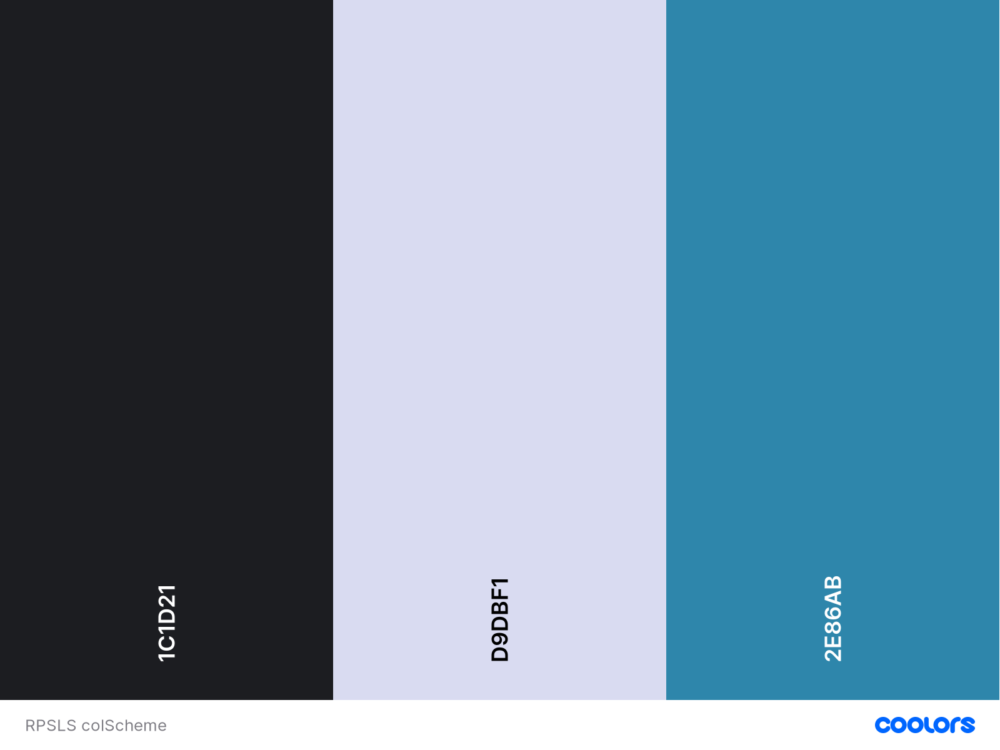
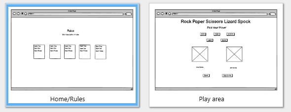

# Rock Paper Scissors Lizard Spock
## About
**Rock Paper Scissors Lizard Spock** is a browser based game of chance inspired by the classic Rock Paper Scissors hand game. The aim of this variation of the game is to beat the computer generated Robot within 10 moves by clicking on your desired move. Highest score wins! If the player wins they can submit their name onto the Highscores board. After submitting your name the game will automatically restart ready to be played again.

## Taget Audience
The **Target Audience** for the site is aimed at users of all ages, specifically with an interest in sci-fi looking to play an intuitive and quick game of chance against the computer. The design leans into the sci-fi relation to the "Spock" move, and the layout was designed to be easy to play and navigate.

## Features
### Landing Page
The landing page displays the game title and the full game play area. The background features an autoplaying video loop of space travel set to a non distracting play speed. The gameplay area has a semi-transparent blue background to contrast against the video to direct focus to the game play elements. when the game first loads, images of the "Player" & "Robot" are displayed until the user selects their first move.

### Game Play Buttons & Scoring
The five gameplay buttons are displayed under the "Choose your move" subtitle. When hovered over with the mouse they change in colour and the cursor changes to a pointer which acts as a click prompt to the player. Once a move is clicked the "Player" & "Robot" images are replaced with the Player's selected move and the Robot's counter move. Clicking on a move button also displays the "Round Counter" which displays how many turns you have taken out of 10. The points scored are displayed on the corresponding score boards.

### Rules Section
The **Rules** section is below the game play area and displays which move combinations win and lose. This section collapses into a column on smaller screens to keep the design tidy.

### Win Lose or Draw
There are three possible outcomes per turn, to win, lose or draw. If the Player wins, they score one point, or if the player loses the Robot scores one point. But if there is a draw an Alert box opens displaying the turn was a draw and no points are scored.

### Player Wins Game
If the Player wins, a modal pops up with the option to enter their name and submit it onto the High Scores board. The Player's first won game will display the modal as shown below:

On multiple plays the high scores are displayed in order as shown below:

### Reset & Score Board Buttons
The **Reset** button resets the game scores and rounds counter back to zero when ever it is clicked. 
The **Score Board** button opens the High Scores modal and can be close by either clicking the close button or outside of the modal in the shaded window of the game.
### Hover
Each clickable element on the website changes color, and the cursor changes to a pointer when hovered over with the mouse. This is to let the user intuitively recognise that they are able to click the button.

## User Experience
### User Stories
* First Time Visitor Aims
    * As a first time visitor, I want to know what the purpose of the website is.
    * As a first time visitor, I want to know how to play the game.
    * As a first time visitor, I want the game playe to be intuitive.
    * As a first time visitor, I want to be able to play the game multiple times.
    * As a first time visitor, I want to know the rules of the game.
    * As a first time visitor, I want to see the choice I made compared to the computer/Robot.
    * As a first time visitor, I want to see my real time score and how many rounds are left.
    * As a first time visitor, I want to be able to submit my name into a scoreboard.
* Returning Visitor Aims
    * As a returning visitor, I want to be able to view my previous scores.
    * As a returning visitor, I want to be able to reset the game at any stage.
    * As a returning visitor, I want the theme to be recognisable and fun.

* Site Owner Aims
    * As the site owner, I want the game to be attractive and responsive.
    * As the site owner, I want the game to be instantly playable for the user.
    * As the site owner, I want the user to return to the site.
    * As the site owner, I want the game to work as intended with random results for the Robot and scores incrementing on each won round.

## Design
### Theme
The theme of the site was inspired by the "Spock" move and I wanted to lean into the space travel/Star Trek aspects associated with the Vulcan hand sign. The background video represents space travel and the main color is based on a pastel blue simlar to Spock's uniform.

### Colors

The color scheme consits of two contrasting shades used for text and backgrounds, and one main feature color.
* Raisin Black
    * Used as the background color for divs, button default text and borders.
* Lavender Web
    * Used as the main text color.
* Blue NCS
    * Used as the feature color for gameplay area background and button borders.

### Fonts
I chose two fonts that compliment eachother that fit to my theme. The title and subtitle font is Orbitron which has the classic sci-fi look to it. 
My score and other info font is Roboto.

### Wireframes
I used Balsamiq to draft the layout for the two main sections of the game. This helped me scope the amount of content needed to achieve a clean basic.

## Testing

## Bugs

## Deployment

## Credits

